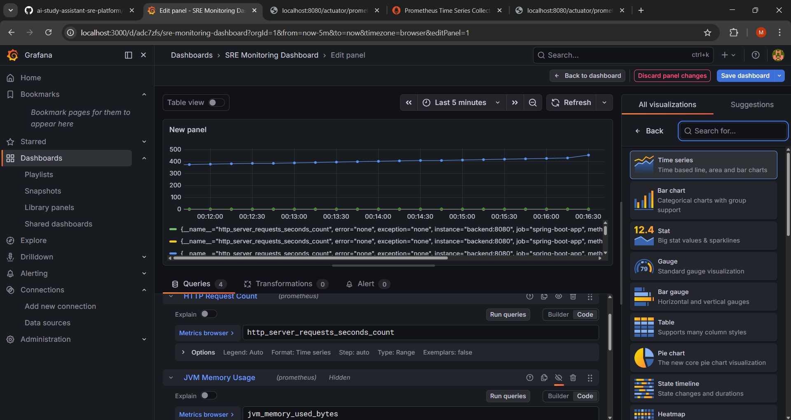
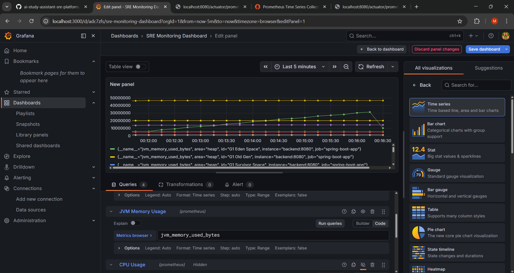
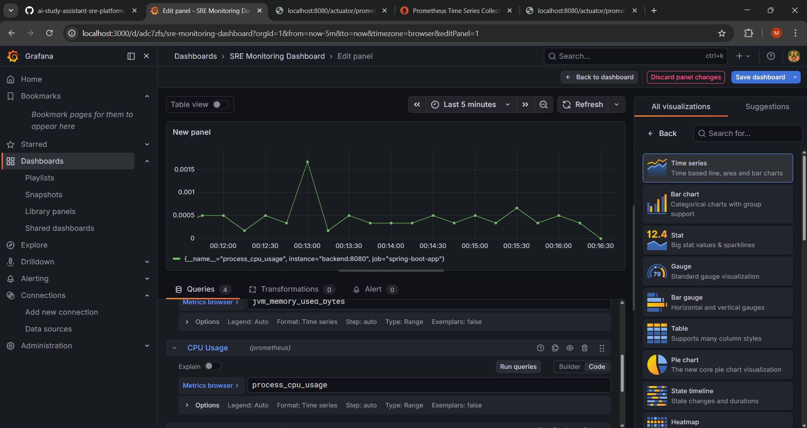
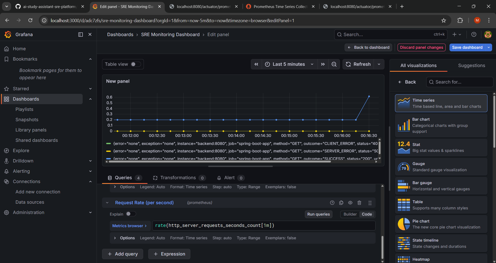
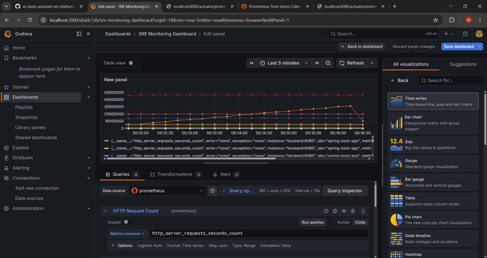
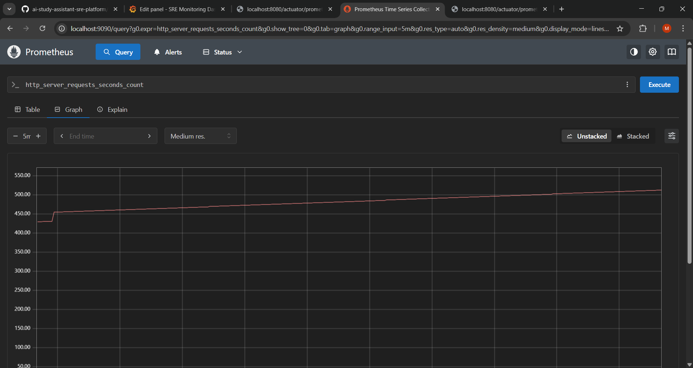
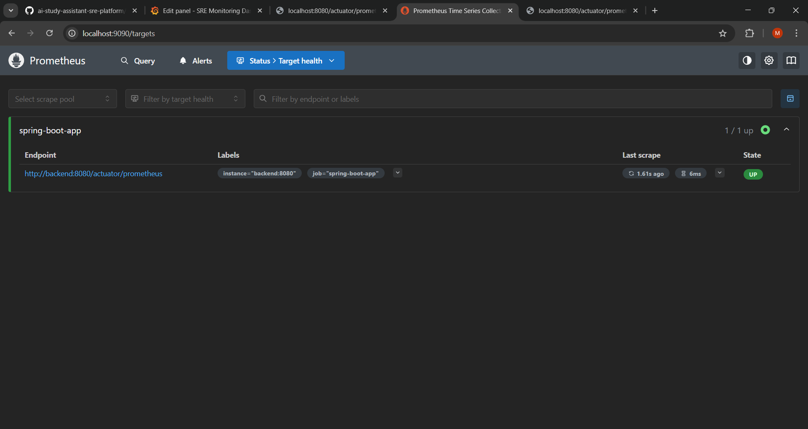

# AI Study Assistant - SRE Observability Platform

## Overview

This project demonstrates a production-ready AI backend system with Site Reliability Engineering (SRE) practices including monitoring, alerting, and containerized deployment. It showcases modern observability practices with Spring Boot, Prometheus, and Grafana integration.


## Architecture

```
User → Spring Boot Backend (Port 8080) → Prometheus → Grafana Dashboard
```

## Features

* REST API built using Spring Boot 3.5.11
* Metrics exposure using Spring Boot Actuator
* Monitoring with Prometheus
* Visualization with Grafana
* MongoDB integration for data persistence
* Containerized using Docker & Docker Compose
* Real-time alerting system

## Tech Stack

* **Backend**: Spring Boot 3.5.11 (Java 17)
* **Database**: MongoDB
* **Monitoring**: Prometheus
* **Visualization**: Grafana
* **Containerization**: Docker & Docker Compose
* **Build Tool**: Maven

## SRE Concepts Implemented

- **Observability** - Comprehensive metrics, logs, and dashboards for system visibility
- **Monitoring using Prometheus** - Time-series database for collecting and storing application metrics
- **Visualization using Grafana** - Interactive dashboards for real-time monitoring and analysis
- **Alerting based on system metrics** - Proactive alerts configured for performance thresholds and anomalies
- **Containerization using Docker** - Consistent environment across development, testing, and production
- **Service health monitoring via Actuator** - Health checks and detailed endpoint metrics via Spring Boot Actuator

## Prerequisites

* **Java 17** or higher
* **Docker** (version 20.10 or higher)
* **Docker Compose** (version 1.29 or higher)
* **Maven** 3.6+ (for local development)

## Project Structure

```
ai-study-assistant-sre-platform/
├── backend/
│   └── ai-assistant/           # Spring Boot backend application
│       ├── src/main/java/      # Java source code
│       ├── src/main/resources/ # Application properties & static files
│       └── pom.xml             # Maven dependencies
├── docker/
│   └── docker-compose.yml      # Docker Compose orchestration
├── k8s/                        # Kubernetes manifests (future deployment)
├── ci-cd/                      # CI/CD pipeline configurations
├── monitoring/
│   └── prometheus.yml          # Prometheus configuration
├── frontend/                   # Frontend application (future)
└── scripts/                    # Utility scripts
```

## API Endpoints

### Health Check
* **GET** `/health` - Application health status
  * Response: `"AI Assistant Backend Running"`

### Metrics & Monitoring
* **GET** `/actuator` - Actuator base endpoint (lists all available endpoints)
* **GET** `/actuator/health` - Detailed application health
* **GET** `/actuator/prometheus` - Prometheus metrics in text format
* **GET** `/actuator/metrics` - Available metrics list

## Configuration

### Application Properties
Located in `backend/ai-assistant/src/main/resources/application.properties`:
```properties
spring.application.name=ai-assistant
management.endpoints.web.exposure.include=*  # Expose all actuator endpoints
management.endpoint.prometheus.enabled=true  # Enable Prometheus endpoint
management.endpoints.web.base-path=/actuator # Actuator base path
```

### MongoDB Connection
The application is configured to use MongoDB (update connection string in application.properties as needed):
```properties
spring.data.mongodb.uri=mongodb://localhost:27017/ai-assistant
```

## Observability Features

### JVM Metrics
* Memory usage (heap, non-heap)
* Garbage collection statistics
* Thread count and states
* CPU usage

### Application Metrics
* API request count and latency
* HTTP status codes distribution
* Database operation metrics

### Real-time Dashboards
Grafana provides visual dashboards for monitoring application health and performance in real-time.

## Alerting

* Configured Alert rules in Grafana for:
  * High API traffic
  * Memory usage threshold breaches
  * Service availability

## ▶ Quick Start

### Using Docker Compose (Recommended)
```bash
cd docker/
docker compose up --build
```

Then access:
* **Application**: http://localhost:8080
* **Application Health**: http://localhost:8080/actuator/health
* **Prometheus Metrics**: http://localhost:8080/actuator/prometheus
* **Prometheus UI**: http://localhost:9090
* **Grafana Dashboards**: http://localhost:3000

### Local Development (Without Docker)

1. **Build the project**:
   ```bash
   cd backend/ai-assistant
   mvn clean package
   ```

2. **Run the application**:
   ```bash
   mvn spring-boot:run
   ```

3. **Access the application**:
   * Health: http://localhost:8080/health
   * Metrics: http://localhost:8080/actuator/prometheus

## Monitoring & Dashboards

### Prometheus
* Scrapes metrics from `/actuator/prometheus` endpoint
* Configuration: `monitoring/prometheus.yml`
* Default scrape interval: 15s

### Grafana
* Default credentials: `admin:admin` (change in production)
* Import existing dashboards or create custom ones
* Set Prometheus as data source

## Screenshots

### Grafana Dashboards







### Prometheus Dashboards



## Troubleshooting

### Port Already in Use
If ports are already in use:
```bash
# Change ports in docker-compose.yml
# Or kill processes on specific ports
```

### MongoDB Connection Issues
Ensure MongoDB is running (within Docker Compose it will start automatically)

### Prometheus Not Scraping Metrics
1. Verify actuator endpoints are exposed
2. Check Prometheus configuration in `monitoring/prometheus.yml`
3. Verify backend service is running on port 8080

## Build & Deployment

### Build with Maven
```bash
mvn clean install
```

### Build Docker Image
```bash
docker build -t ai-assistant:latest backend/ai-assistant/
```

### Deploy to Kubernetes
Kubernetes manifests are available in the `k8s/` directory for future production deployments.

## Contributing

Contributions are welcome! Please follow the existing code style and structure.
